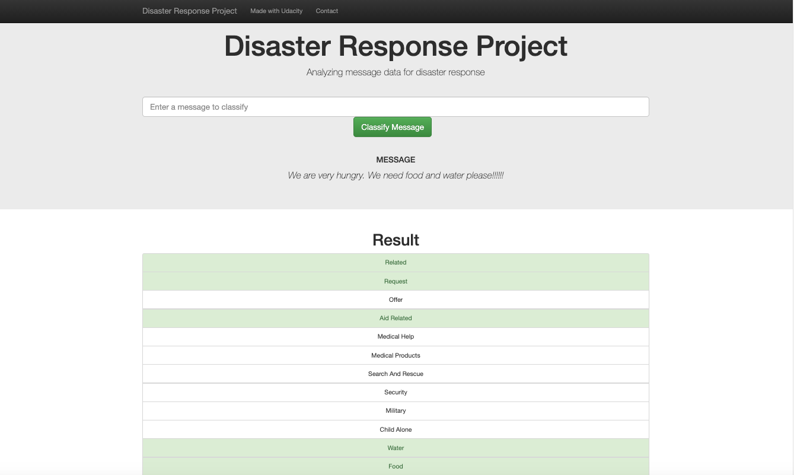

# disaster_response

**Introduction**

Hi, welcome to this project. I created this repository as a part of the data science nanodegree on udacity.

**Instructions**
1. To get started clone this repository with 
`git clone https://github.com/TobiPrae/disaster_response_pipeline.git`

2. Installations.
    - `pip install plotly==4.13.0`

3. Run the following commands in the project's root directory to set up your database and model.

    - To run ETL pipeline that cleans data and stores in database
        `python data/process_data.py data/disaster_messages.csv data/disaster_categories.csv data/DisasterResponse.db`
    - To run data preparation for visualization and store results in db
        `python data/prepare_plots.py`
    - To run ML pipeline that trains classifier and saves
        `python models/train_classifier.py data/DisasterResponse.db models/classifier.pkl`

4. Run the following command in the app's root directory to run your web app.
    `python app/run.py`

5. Go to http://0.0.0.0:3001/

**Files** 

| Name                   | Description                                   | Folder   |
| ---------------------- |-----------------------------------------------| ---------|
| DisasterResponse.db    | Contains df for training and for plots        | data     |
| disaster_categories.csv| Contains message categories (labels)          | data     |
| disaster_messages.csv  | Contains messages                             | data     |
| prepare_plots.py       | Transforms data once for plots                | data     |
| process_data.py        | Merge categories and messages                 | data     |
| classifier.pkl         | Trained AdaBoostClassifier                    | models   |
| tokenizer.py           | Tokenizer function                            | models   |
| train_classifier.py    | Trains new classifier using GridSearch        | models   |
| README.md              | ReadMe Document                               | root     |
| run.py                 | Used to run app                               | app      |
| go.html                | Contains html logic for classification results| templates|
| master.html            | Contains basic html logic for app             | templates|

**Description and Results**

The goal of the project is to classify messages collected in the context of disasters. These messages should then be assigned to a category, where each message can have multiple labels.

For this purpose, ETL and ML pipelines should be combined. I have tested different classifiers from scikit-learn based on an average weighted F1 score compared with each other. I chose the AdaBoostClassifier, which is an ensemble algorithm that uses decision trees as a base estimator. I used GridSearch to tune several hyperparameters (max_depth of DecisionTrees and n_estimators). In addition to the tokenized messages, I used several custom features like WordCounter or TextLength. The model was able to achieve a weighted average F1 score of approximately 0.9428.

However, the strong class imbalance must be considered when looking at the results. This is not uncommon with text data, but there are several approaches to tackle this imbalance:
- You could try to figure out which messages are very similar. So they are not exactly duplicates but have the same semantic meaning (e.g. "We need food please" vs. "Please give us food")
- You could use advanced methods like undersampling (drop data points from the majority class) or oversampling (replicate data points from the minority class)
- Another advanced technique is data augmentation. This technique is very prominent computer vision. Here, you transform samples (e.g. mirroring images or add noise). With text data you could achieve this with adding word synonyms.
- Get more data if you can

You could also try to generate even more features or do more hyperparameter tuning. However, I believe that this would only lead to marginal improvements and - especially with hyperparameter tuning - would be computationally intensive.

